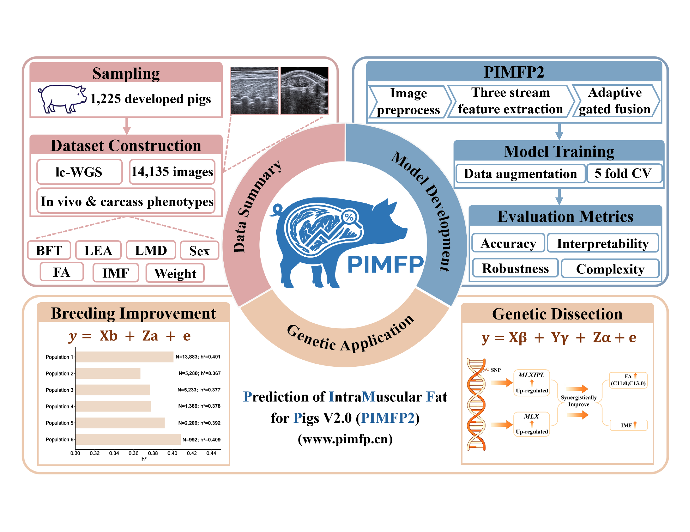

# PIMFP2

This repository provides the code and analysis pipelines used in this study, including (1) the source code for the PIMFP2 web tool, which supports multiple input configurations, including unimodal and multimodal inputs as well as single-view and multi-view inputs; and (2) analysis pipelines for intramuscular fat (IMF) and fatty acid (FA) traits, including genome-wide association studies (GWAS), genetic evaluation, and visualization.
You are welcome to directly use the PIMFP2 web platform at [https://www.pimfp.cn/](https://www.pimfp.cn/).

**For review purposes, a test account has been provided for the PIMFP2 platform. Both the username and password are `testuser@pimfp.cn`.**

